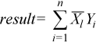

.. _dotc:

dotc
====

.. container::

   Computes the dot product of two complex vectors, conjugating the
   first vector.

   .. container:: section
      :name: GUID-9D36611B-564D-475B-8D98-5F53A4F698F5

      .. rubric:: Syntax
         :name: syntax
         :class: sectiontitle

      .. cpp:function::  void dotc(queue &exec_queue, std::int64_t n,      buffer<T,1> &x, std::int64_t incx, buffer<T,1> &y, std::int64_t      incy, buffer<T,1> &result)

      ``dotc`` supports the following precisions.

      .. list-table:: 
         :header-rows: 1

         * -  T 
         * -  ``std::complex<float>`` 
         * -  ``std::complex<double>`` 

.. container:: section
   :name: GUID-3E4588D2-5FDE-43F1-955E-85173AE62252

   .. rubric:: Description
      :name: description
      :class: sectiontitle

   The ``dotc`` routines perform a dot product between two complex
   vectors, conjugating the first of them:

   |image0|

.. container:: section
   :name: GUID-38675523-DEDD-4314-8486-7C66614ED2C7

   .. rubric:: Input Parameters
      :name: input-parameters
      :class: sectiontitle

   exec_queue
      The queue where the routine should be executed.

   n
      The number of elements in vectors ``x`` and ``y``.

   x
      Buffer holding input vector ``x``. The buffer must be of size at
      least (1 + (``n`` - 1)*abs(``incx``)). See `Matrix and Vector
      Storage <../matrix-storage.html>`__ for
      more details.

   incx
      The stride of vector ``x``.

   y
      Buffer holding input vector ``y``. The buffer must be of size at
      least (1 + (``n`` - 1)*abs(``incy``)). See `Matrix and Vector
      Storage <../matrix-storage.html>`__ for
      more details..

   incy
      The stride of vector ``y``.

.. container:: section
   :name: GUID-B84A5D05-6B61-4D13-8185-2A349C41CE46

   .. rubric:: Output Parameters
      :name: output-parameters
      :class: sectiontitle

   result
      The buffer where the result (a scalar) is stored.

.. container:: familylinks

   .. container:: parentlink

      **Parent topic:** :ref:`blas-level-1-routines`
      

.. container::

