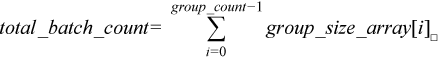
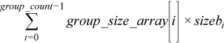
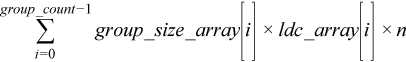

.. _gemm_batch:

gemm_batch
==========

.. container::

   Computes groups of matrix-matrix product with general matrices.

   .. container:: section
      :name: GUID-7885D940-FAC1-4F37-9E1C-A022DED99EBD

      .. rubric:: Syntax
         :name: syntax
         :class: sectiontitle

      **Group API**

      .. cpp:function::  void gemm_batch(queue &exec_queue,      buffer<transpose, 1> &transa_array, buffer<transpose,1>      &transb_array, buffer<std::int64_t,1> &m_array,      buffer<std::int64_t,1> &n_array, buffer<std::int64_t,1> &k_array,      buffer<T,1> alpha_array, buffer<T,1> &a_array,      buffer<std::int64_t,1> &lda_array, buffer<T,1> &b_array,      buffer<std::int64_t,1> ldb_array, buffer<T,1> &beta_array,      buffer<T,1> &c, buffer<std::int64_t,1> &ldc_array, std::int64_t      group_count, buffer<std::int64_t,1> &group_size_array)

      **Strided API**

      .. cpp:function::  void gemm_batch(queue &exec_queue, transpose      transa, transpose transb, std::int64_t m, std::int64_t n,      std::int64_t k, T alpha, buffer<T,1> &a, std::int64_t &lda,      std::int64_t stridea, buffer<T,1> &b, std::int64_t ldb,      std::int64_t strideb, T beta, buffer<T,1> &c, std::int64_t ldc,      std::int64_t stridec, std::int64_t batch_size)

      ``gemm_batch`` supports the following precisions.

      .. list-table:: 
         :header-rows: 1

         * -  T 
         * -  ``float`` 
         * -  ``double`` 
         * -  ``std::complex<float>`` 
         * -  ``std::complex<double>`` 

.. container:: section
   :name: GUID-14237C95-6322-47A4-BC11-D3CDD2118C42

   .. rubric:: Description
      :name: description
      :class: sectiontitle

   The gemm_batch routines perform a series of matrix-matrix operations
   with general matrices. They are similar to the gemm routine
   counterparts, but the gemm_batch routines perform matrix-matrix
   operations with groups of matrices. The groups contain matrices with
   the same parameters.

   For the group API, the operation is defined as

   ::

      offa = 0, offb = 0, offc = 0
      for i = 0 … group_count – 1
          transa, transb, m, n, k, lda, ldb, ldc, alpha, beta and group_size at position i in transa_array, transb_array, m_array, n_array, k_array, lda_array, ldb_array, ldc_array, alpha_array, beta_array and group_size_array
          sizea = transa == onemkl::transpose::N ? lda * k : lda * m;
          sizeb = transb == onemkl::transpose::N ? ldb * n : ldb * k;
          sizec = ldc * n;
          for j = 0 … group_size – 1
              A, B, and C are matrices of size sizea, sizeb and sizec at offset offa, offb and offc in a, b and c.
              C := alpha * op(A) * op(B) + beta * C
              offa += sizea, offb += sizeb, offc += sizec
          end for
      end for

   For the strided API, the operation is defined as

   ::

      for i = 0 … batch_size – 1
          A, B and C are matrices at offset i * stridea, i * strideb, i * stridec in a, b and c.
          C = alpha * op(A) * op(B) + beta * C
      end for

   where:

   -  op(X) is one of op(X) = X, or op(X) = X\ :sup:`T`, or op(X) =
      X\ :sup:`H`

   -  ``alpha`` and ``beta`` are scalars

   -  ``A``, ``B``, and ``C`` are matrices

   -  The a, b and c buffers contains all the input matrices. The stride
      between matrices is either given by the exact size of the matrix
      (for the group API) or by the stride parameter. The total number
      of matrices in a, b and c buffers is given by the 
      
      |image0| 
      
      for the
      group API or by the ``batch_size`` parameter for the strided API.

   Here, op(``A``) is ``m``\ ``x``\ ``k``, op(``B``) is
   ``k``\ ``x``\ ``n``, and ``C`` is ``m``\ ``x``\ ``n``.

.. container:: section
   :name: GUID-863264A0-4CE9-495F-A617-102E46D7A41A

   .. rubric:: Input Parameters - Group API
      :name: input-parameters---group-api
      :class: sectiontitle

   transa_array
      Buffer holding ``group_count onemkl::transpose`` value.

      For the group ``i``, ``transa`` is the ``i``\ th element in the
      transa_array buffer and specifies the form of ``op(A)`` used in
      the matrix multiplication. See
      :ref:`onemkl_datatypes` for more
      details.

   transb_array
      Buffer holding ``group_count onemkl::transpose`` value.

      For the group ``i``, ``transb`` is the ``i``\ th element in the
      transb_array buffer and specifies the form of ``op(B)`` used in
      the matrix multiplication. See
      :ref:`onemkl_datatypes` for more
      details.

   m_array
      Buffer holding ``group_count`` integer. For the group ``i``, ``m``
      is the ``i``\ th element in the m_array buffer and specifies the
      number of rows of ``op(A)`` and ``C``. Must be at least zero.

   n_array
      Buffer holding ``group_count`` integer. For the group ``i``, ``n``
      is the ``i``\ th element in the n_array buffer and specifies the
      number of columns of ``op(B)`` and ``C``. Must be at least zero.

   k_array
      Buffer holding ``group_count`` integer. For the group ``i``, ``k``
      is the ``i``\ th element in the k_array buffer and specifies the
      number of columns of ``op(A)`` and rows of ``op(B)``. Must be at
      least zero.

   alpha_array
      Buffer holding ``group_count`` scalar element. For the group
      ``i``, ``alpha`` is the ``i``\ th element in the alpha_array
      buffer and specifies the scaling factor for the matrix-matrix
      product.

   a
      Buffer holding the input matrices ``A``. The total size of the
      buffer ``a`` must be at least the sum of the sizes of all the
      matricies ``A``. That is,

      |image1|

      where
      ``sizeai = lda_array[i] * (transa == onemkl::transpose::N ? k : m)``

      See `Matrix
      Storage <../matrix-storage.html>`__ for
      more details.

   lda_array
      Buffer holding ``group_count`` integer. For the group ``i``,
      ``lda`` is the ``i``\ th element in the lda_array buffer and
      specifies the leading dimension of ``A``. Must be at least ``m``
      if ``A`` is not transposed, and at least ``k`` if ``A`` is
      transposed. Must be positive.

   b
      Buffer holding the input matrices ``B``. The total size of the
      buffer ``b`` must be at least the sum of the sizes of all the
      matricies ``B``. That is,

      |image2|

      where
      ``sizebi = ldb_array[i] * (transb == onemkl::transpose::N ? n : k)``

      See `Matrix
      Storage <../matrix-storage.html>`__ for
      more details.

   ldb_array
      Buffer holding ``group_count`` integer. For the group ``i``,
      ``ldb`` is the ``i``\ th element in the ldb_array buffer and
      specifies the leading dimension of ``B``. Must be at least ``k``
      if ``B`` is not transposed, and at least ``n`` if ``B`` is
      transposed. Must be positive.

   beta_array
      Buffer holding ``group_count`` scalar element. For the group
      ``i``, ``beta`` is the ``i``\ th element in the beta_array buffer
      and specifies the scaling factor for matrix C.

   c
      Buffer holding the input/output matrices ``C``. The total size of
      the buffer ``c`` must be at least the sum of the sizes of all the
      matricies ``C``. That is,

      |image3|

      See `Matrix
      Storage <../matrix-storage.html>`__ for
      more details.

   ldc_array
      Buffer holding ``group_count`` integer. For the group ``i``,
      ``ldc`` is the ``i``\ th element in the ldc_array buffer and
      specifies the leading dimension of ``C``. Must be positive and at
      least ``m``.

   group_count
      Specifies the number of groups. Must be at least 0.

   group_size_array
      Buffer holding ``group_count`` integer. For the group ``i``, the
      ``i``\ th element in the group_size_array buffer specifies the
      number of matrix multiply operations in group ``i``. Each element
      in ``group_size_array`` must be at least 0.

.. container:: section
   :name: GUID-1E4953E6-F7B1-4FEE-BA5A-8C4BD51DC700

   .. rubric:: Output Parameters - Group API
      :name: output-parameters---group-api
      :class: sectiontitle

   c
      Overwritten by the ``m``\ :sub:`i`-by-``n``\ :sub:`i` matrix
      ``(alphai*op(A)*op(B) + betai*C)`` for group ``i``.

.. container:: section
   :name: GUID-D067773A-45A3-4D24-B10A-46E27834947E

   .. rubric:: Input Parameters - Strided API
      :name: input-parameters---strided-api
      :class: sectiontitle

   transa
      Specifies ``op(A)`` the transposition operation applied to the
      matrices A. See
      :ref:`onemkl_datatypes` for more
      details.

   transb
      Specifies ``op(B)`` the transposition operation applied to the
      matrices B. See
      :ref:`onemkl_datatypes` for more
      details.

   m
      Number of rows of ``op(A)`` and ``C``. Must be at least zero.

   n
      Number of columns of ``op(B)`` and ``C``. Must be at least zero.

   k
      Number of columns of ``op(A)`` and rows of ``op(B)``. Must be at
      least zero.

   alpha
      Scaling factor for the matrix-matrix products.

   a
      Buffer holding the input matrices ``A``. Must have size at least
      ``stridea*batch_size``.

   lda
      Leading dimension of the matrices ``A``. Must be at least ``m`` if
      the matrices ``A`` are not transposed, and at least ``k`` if the
      matrices ``A`` are transposed. Must be positive.

   stridea
      Stride between the different ``A`` matrices.

      If ``A`` are not transposed, the matrices ``A`` are ``m``-by-``k``
      matrices so stridea must be at least ``lda*k``.

      If ``A`` are transposed, the matrices ``A`` are ``k``-by-``m``
      matrices so stridea must be at least ``lda*m``.

   b
      Buffer holding the input matrices ``B``. Must have size at least
      ``strideb*batch_size``.

   ldb
      Leading dimension of the matrices ``B``. Must be at least ``k`` if
      the matrices ``B`` are not transposed, and at least ``n`` if the
      matrices ``B`` are transposed. Must be positive.

   strideb
      Stride between the different ``B`` matrices.

      If ``B`` are not transposed, the matrices ``B`` are ``k``-by-``n``
      matrices so strideb must be at least ``ldb*n``.

      If ``B`` are transposed, the matrices ``B`` are ``n``-by-``k``
      matrices so strideb must be at least ``ldb*k``.

   beta
      Scaling factor for the matrices ``C``.

   c
      Buffer holding input/output matrices ``C``. Must have size at
      least ``stridec*batch_size``.

   ldc
      Leading dimension of ``C``. Must be positive and at least ``m``.

   stridec
      Stride between the different ``C`` matrices. Must be at least
      ``ldc*n``.

   batch_size
      Specifies the number of matrix multiply operations to perform.

.. container:: section
   :name: GUID-98C3DE17-4F5F-41A1-B431-48148153ABBA

   .. rubric:: Output Parameters - Strided API
      :name: output-parameters---strided-api
      :class: sectiontitle

   c
      Output buffer, overwritten by ``batch_size`` matrix multiply
      operations of the form\ ``alpha*op(A)*op(B) + beta*C``.

.. container:: section
   :name: GUID-AC72653A-4AC8-4B9D-B7A9-13A725AA19BF

   .. rubric:: Notes
      :name: notes
      :class: sectiontitle

   If ``beta`` = 0, matrix ``C`` does not need to be initialized before
   calling gemm_batch.

.. container:: familylinks

   .. container:: parentlink

      **Parent topic:** :ref:`blas-like-extensions`
      

.. container::

.. |image1| image:: ../equations/GUID-D797E8FA-B0CE-417C-98F1-896CDFB4Fee2.png
   :class: img-middle

