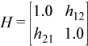

.. _onemkl_blas_rotm:

rotm
====

.. container::

   Performs modified Givens rotation of points in the plane.

      ``rotm`` supports the following precisions.

      .. list-table:: 
         :header-rows: 1

         * -  T 
         * -  ``float`` 
         * -  ``double`` 

.. container:: section

   .. rubric:: Description
      :class: sectiontitle

   Given two vectors ``x`` and ``y``, each vector element of these
   vectors is replaced as follows:

   | 
   | |image0|

   for ``i`` from 1 to ``n``, where ``H`` is a modified Givens
   transformation matrix.

rotm (Buffer Version)
---------------------

.. container::

   .. container:: section

      .. rubric:: Syntax
         :class: sectiontitle

      .. cpp:function::  void onemkl::blas::rotm(sycl::queue &queue, std::int64_t n,      sycl::buffer<T,1> &x, std::int64_t incx, sycl::buffer<T,1> &y, std::int64_t      incy, sycl::buffer<T,1> &param)
.. container:: section

   .. rubric:: Input Parameters
      :class: sectiontitle

   queue
      The queue where the routine should be executed.

   n
      Number of elements in vector ``x``.

   x
      Buffer holding input vector ``x``. The buffer must be of size at
      least (1 + (``n`` - 1)*abs(``incx``)). See `Matrix and Vector
      Storage <../matrix-storage.html>`__ for
      more details.

   incx
      Stride of vector ``x``.

   y
      Buffer holding input vector ``x``. The buffer must be of size at
      least (1 + (``n`` - 1)*abs(``incy``)). See `Matrix and Vector
      Storage <../matrix-storage.html>`__ for
      more details.

   incy
      Stride of vector ``y``.

   param
      Buffer holding an array of size 5. The elements of the ``param``
      array are:

      ``param``\ [0] contains a switch, ``flag``,

      ``param``\ [1-4] contain *h\ 11*, \ *h\ 21*, *h\ 12*, and \ *h\ 22*
      respectively, the components of the modified Givens transformation
      matrix ``H``.

      Depending on the values of ``flag``, the components of ``H`` are
      set as follows:

      | ``flag =``\ ``-1.0``:
      | |image1|

      | ``flag =``\ ``0.0``:
      | |image2|

      | ``flag =``\ ``1.0``:
      | |image3|

      | ``flag =``\ ``-2.0``:
      | |image4|

      In the last three cases, the matrix entries of 1.0, -1.0, 0.0 are
      assumed based on the value of ``flag`` and are not required to be
      set in the ``param`` vector.

.. container:: section

   .. rubric:: Output Parameters
      :class: sectiontitle

   x
      Buffer holding updated buffer ``x``.

   y
      Buffer holding updated buffer ``y``.

rotm (USM Version)
------------------

.. container::

   .. container:: section

      .. rubric:: Syntax
         :class: sectiontitle

      .. container:: dlsyntaxpara

         .. cpp:function::  sycl::event onemkl::blas::rotm(sycl::queue &queue, std::int64_t n, T *x, std::int64_t incx, T *y, std::int64_t incy, T *param, const sycl::vector_class<sycl::event> &dependencies = {})
   .. container:: section

      .. rubric:: Input Parameters
         :class: sectiontitle

      queue
         The queue where the routine should be executed.

      n
         Number of elements in vector ``x``.

      x
         Pointer to the input vector ``x``. The array holding the vector
         ``x`` must be of size at least (1 + (``n`` - 1)*abs(``incx``)).
         See `Matrix and Vector
         Storage <../matrix-storage.html>`__ for
         more details.

      incx
         Stride of vector ``x``.

      yparam
         Pointer to the input vector ``y``. The array holding the vector
         ``y`` must be of size at least (1 + (``n`` - 1)*abs(``incy``)).
         See `Matrix and Vector
         Storage <../matrix-storage.html>`__ for
         more details.

      incy
         Stride of vector ``y``.

      param
         Pointer to an array of size 5. The elements of the ``param``
         array are:

         ``param``\ [0] contains a switch, ``flag``,

         ``param``\ [1-4] contain *h\ 11*, \ *h\ 21*, *h\ 12*, and \ *h\ 22*
         respectively, the components of the modified Givens
         transformation matrix ``H``.

         Depending on the values of ``flag``, the components of ``H`` are
         set as follows:

         | ``flag =``\ ``-1.0``:
         | |image1|

         | ``flag =``\ ``0.0``:
         | |image2|

         | ``flag =``\ ``1.0``:
         | |image3|

         | ``flag =``\ ``-2.0``:
         | |image4|

         In the last three cases, the matrix entries of 1.0, -1.0, 0.0
         are assumed based on the value of ``flag`` and are not required
         to be set in the ``param`` vector.

      dependencies
         List of events to wait for before starting computation, if any.
         If omitted, defaults to no dependencies.

   .. container:: section

      .. rubric:: Output Parameters
         :class: sectiontitle

      x
         Pointer to the updated array ``x``.

      y
         Pointer to the updated array ``y``.

   .. container:: section

      .. rubric:: Return Values
         :class: sectiontitle

      Output event to wait on to ensure computation is complete.

.. container:: familylinks

   .. container:: parentlink

      **Parent topic:** :ref:`blas-level-1-routines`
.. |image0| image:: ../equations/GUID-67FC4AB3-40CB-441F-BA9F-88BAAC78Cee1.png
.. |image1| image:: ../equations/GUID-67FC4AB3-40CB-441F-BA9F-88BAAC78Cee2.png

.. |image3| image:: ../equations/GUID-67FC4AB3-40CB-441F-BA9F-88BAAC78Cee4.png
.. |image4| image:: ../equations/GUID-67FC4AB3-40CB-441F-BA9F-88BAAC78Cee5.png

