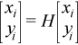
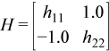
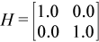

.. _rotm:

rotm
====

.. container::

   Performs modified Givens rotation of points in the plane.

   .. container:: section
      :name: GUID-F8F2E2EB-1704-454D-BE45-C055D6F4E7D6

      .. rubric:: Syntax
         :name: syntax
         :class: sectiontitle

      .. cpp:function::  void rotm(queue &exec_queue, std::int64_t n,      buffer<T,1> &x, std::int64_t incx, buffer<T,1> &y, std::int64_t      incy, buffer<T,1> &param)

      ``rotm`` supports the following precisions.

      .. list-table:: 
         :header-rows: 1

         * -  T 
         * -  ``float`` 
         * -  ``double`` 

.. container:: section
   :name: GUID-856650C6-2998-4452-A34A-DF6CB801087D

   .. rubric:: Description
      :name: description
      :class: sectiontitle

   Given two vectors ``x`` and ``y``, each vector element of these
   vectors is replaced as follows:

   | 
   | |image0|

   for ``i`` from 1 to ``n``, where ``H`` is a modified Givens
   transformation matrix.

.. container:: section
   :name: GUID-A615800D-734E-4997-BB91-1C76AEEE9EC2

   .. rubric:: Input Parameters
      :name: input-parameters
      :class: sectiontitle

   exec_queue
      The queue where the routine should be executed.

   n
      Number of elements in vector ``x``.

   x
      Buffer holding input vector ``x``. The buffer must be of size at
      least (1 + (``n`` - 1)*abs(``incx``)). See `Matrix and Vector
      Storage <../matrix-storage.html>`__ for
      more details.

   incx
      Stride of vector x.

   y
      Buffer holding input vector ``x``. The buffer must be of size at
      least (1 + (``n`` - 1)*abs(``incy``)). See `Matrix and Vector
      Storage <../matrix-storage.html>`__ for
      more details.

   incy
      Stride of vector y.

   param
      Buffer holding an array of size 5. The elements of the ``param``
      array are:

      ``param``\ [0] contains a switch, ``flag``,

      ``param``\ [1-4] contain *h\ 11*,\ *h\ 21*, *h\ 12*,\ *h\ 22*
      respectively, the components ofthe modified Givens transformation
      matrix ``H``.

      Depending on the values of ``flag``, thecomponents of ``H`` are
      set as follows:

      | ``flag =``\ ``-1.0``:
      | |image1|

      | ``flag =``\ ``0.0``:
      | |image2|

      | ``flag =``\ ``1.0``:
      | |image3|

      | ``flag =``\ ``-2.0``:
      | |image4|

      In the last three cases, the matrix entries of 1.0, -1.0, 0.0 are
      assumed based on the value of ``flag`` and are not required to be
      set in the ``param`` vector.

.. container:: section
   :name: GUID-062D805B-68FF-41F6-8D9A-329C92A77EA3

   .. rubric:: Output Parameters
      :name: output-parameters
      :class: sectiontitle

   x
      Buffer holding updated buffer ``x``.

   y
      Buffer holding updated buffer ``y``.

.. container:: familylinks

   .. container:: parentlink

      **Parent topic:** :ref:`blas-level-1-routines`
      

.. container::

.. |image1| image:: ../equations/GUID-608D9BA6-827F-48DE-A01F-0EE5991F7ee2.png
.. |image2| image:: ../equations/GUID-608D9BA6-827F-48DE-A01F-0EE5991F7ee3.png

