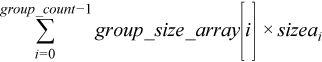

.. _trsm_batch:

trsm_batch
==========

.. container::

   Computes groups of matrix-matrix product with general matrices.

   .. container:: section
      :name: GUID-6F8E0E22-B30A-4825-B508-CEDE0CAC8B90

      .. rubric:: Syntax
         :name: syntax
         :class: sectiontitle

      **Group API**

      .. cpp:function::  void trsm_batch(queue &exec_queue, buffer<side,      1> &left_right_array, buffer<uplo,1> &upper_lower_array,      buffer<transpose,1> &trans_array, buffer<diag,1> &unit_diag_array,      buffer<std::int64_t,1> &m_array, buffer<std::int64_t,1> &n_array,      buffer<T,1> &alpha_array, buffer<T,1> &a_array,      buffer<std::int64_t,1> &lda_array, buffer<T,1> &b_array,      buffer<std::int64_t,1> ldb_array, std::int64_t group_count,      buffer<std::int64_t,1> &group_size_array)

      **Strided API**

      .. cpp:function::  void trsm_batch(queue &exec_queue, side      left_right, uplo upper_lower, transpose trans, diag unit_diag,      std::int64_t m, std::int64_t n, T alpha, buffer<T,1> &a,      std::int64_t lda, std::int64_t stridea, buffer<T,1> &b,      std::int64_t ldb, std::int64_t strideb, std::int64_t batch_size)

      ``trsm_batch`` supports the following precisions.

      .. list-table:: 
         :header-rows: 1

         * -  T 
         * -  ``float`` 
         * -  ``double`` 
         * -  ``std::complex<float>`` 
         * -  ``std::complex<double>`` 

.. container:: section
   :name: GUID-AE6CFEF4-4058-49C3-BABC-2B05D6594555

   .. rubric:: Description
      :name: description
      :class: sectiontitle

   The trsm_batch routines solve a series of equations of the form op(A)
   \* X = alpha \* B or X \* op(A) = alpha \* B. They are similar to the
   trsm routine counterparts, but the trsm_batch routines solve linear
   equations with groups of matrices. The groups contain matrices with
   the same parameters.

   For the group API, the operation is defined as

   ::

      offa = 0, offb = 0
      for i = 0 … group_count – 1
          left_right, uplo, trans, unit_diag, m, n, lda, ldb, alpha and group_size at position i in left_right_array, uplo_array, trans_array, unit_diag_array, m_array, n_array, lda_array, ldb_array, alpha_array and group_size_array
          sizea = left_right == onemkl::side::L ? lda * m : lda * n;
          sizeb = ldb * n;
          for j = 0 … group_size – 1
              A and B are matrices of size sizea and sizeb at offset offa and offb in a and b.
              if (left_right == onemkl::side::L) then
                  computes X such that op(A) * X = alpha * B
              else
                  computes X such that X * op(A) = alpha * B
              end if
              B := X
              offa += sizea, offb += sizeb
          end for
      end for     

   For the strided API, the operation is defined as

   ::

      for i = 0 … batch_size – 1
          A and B are matrices at offset i * stridea and i * strideb in a and b.
          if (left_right == onemkl::side::L) then
              computes X such that op(A) * X = alpha * B
          else
              computes X such that X * op(A) = alpha * B
          end if
          B := X
      end for

   where:

   -  op(``A``) is one of op(``A``) = ``A``, or op(A) = ``A``\ :sup:`T`,
      or op(``A``) = ``A``\ :sup:`H`

   -  alpha is a scalar

   -  ``A`` is a triangular matrix

   -  ``B`` and ``X`` are ``m`` x ``n`` general matrices

   -  The a and b buffers contains all the input matrices. The stride
      between matrices is either given by the exact size of the matrix
      (for the group API) or by the stride parameter. The total number
      of matrices in a and b is given by the 
      
      |image0| 
      
      for the strided
      API.

   ``A`` is either ``m`` x ``m`` or ``n`` x ``n``,depending on whether
   it multiplies ``X`` on the leftor right. On return, the matrix ``B``
   is overwrittenby the solution matrix ``X``.

.. container:: section
   :name: GUID-863264A0-4CE9-495F-A617-102E46D7A41A

   .. rubric:: Input Parameters - Group API
      :name: input-parameters---group-api
      :class: sectiontitle

   left_right_array
      Buffer holding ``group_count onemkl::side`` value.

      For the group ``i``, ``left_right`` is the ``i``\ th element in
      the left_right_array buffer and specifies whether ``A`` multiplies
      ``X`` on the left (``side::left``) or on the right
      (``side::right``). See
      :ref:`onemkl_datatypes` for more
      details.

   uplo_array
      Buffer holding ``group_count onemkl::uplo`` value.

      For the group ``i``, ``uplo`` is the ``i``\ th element in the
      uplo_array buffer and specifies whether ``A`` is upper or lower
      triangular. See
      :ref:`onemkl_datatypes` for more
      details.

   trans_array
      Buffer holding ``group_count onemkl::transpose`` value.

      For the group ``i``, ``trans`` is the ``i``\ th element in the
      trans_array buffer and specifies the form of ``op``\ (``A``) used
      in the matrix multiplication. See
      :ref:`onemkl_datatypes` for more
      details.

   unit_diag__array
      Buffer holding ``group_count onemkl::diag`` value.

      For the group ``i``, ``unit_diag`` is the ``i``\ th element in the
      unit_diag_array buffer and specifies whether ``A`` is assumed to
      be unit triangular (all diagonal elements are 1). See
      :ref:`onemkl_datatypes` for more
      details.

   m_array
      Buffer holding ``group_count`` integer. For the group ``i``, ``m``
      is the ``i``\ th element in the m_array buffer and specifies the
      number of rows of ``B``. Must be at least zero.

   n_array
      Buffer holding ``group_count`` integer. For the group ``i``, ``n``
      is the ``i``\ th element in the n_array buffer and specifies the
      number of columns of ``B``. Must be at least zero.

   alpha_array
      Buffer holding ``group_count`` scalar element. For the group
      ``i``, ``alpha`` is the ``i``\ th element in the alpha_array
      buffer and specifies the scaling factor for the matrix-matrix
      product.

   a
      Buffer holding the input matrix ``A``. The total size of the
      buffer ``a`` must be at least the sum of the sizes of all the
      matricies ``A``. That is,

      |image1|

      where
      ``sizeai = lda_array[i] * (left_right == onemkl::side::L ? m : n)``

      See `Matrix
      Storage <../matrix-storage.html>`__ for
      more details.

   lda_array
      Buffer holding ``group_count`` integer. For the group ``i``,
      ``lda`` is the ``i``\ th element in the lda_array buffer and
      specifies the leading dimension of ``A``. Must be at least ``m``
      if ``A`` is not transposed, and at least ``k`` if ``A`` is
      transposed. Must be positive.

   b
      Buffer holding the input matrix ``B``. The total size of the
      buffer ``b`` must be at least the sum of the sizes of all the
      matricies ``B``. That is,

      |image2|

      See `Matrix
      Storage <../matrix-storage.html>`__ for
      more details.

   ldb_array
      Buffer holding ``group_count`` integer. For the group ``i``,
      ``ldb`` is the ``i``\ th element in the ldb_array buffer and
      specifies the leading dimension of ``B``. Must be at least ``n``.
      Must be positive.

   group_count
      Specifies the number of groups. Must be at least 0.

   group_size_array
      Buffer holding the group_count integer. For the group ``i``,
      ``ldb`` is the ``i``\ th element in the group_size_array buffer
      specifies the number of matrix multiply operations in
      group\ ``i``. Each element in group_size_array must be at least 0.

.. container:: section
   :name: GUID-1E4953E6-F7B1-4FEE-BA5A-8C4BD51DC700

   .. rubric:: Output Parameters - Group API
      :name: output-parameters---group-api
      :class: sectiontitle

   b
      Output buffer, overwritten by the ``total_batch_count`` solution
      matrices ``X``.

.. container:: section
   :name: GUID-D067773A-45A3-4D24-B10A-46E27834947E

   .. rubric:: Input Parameters - Strided API
      :name: input-parameters---strided-api
      :class: sectiontitle

   left_right
      Specifies whether the matrices ``A`` multiply ``X`` on the left
      (``side::left``) or on the right (``side::right``). See
      :ref:`onemkl_datatypes` for more
      details.

   uplo
      Specifies whether the matrices ``A`` are upper or lower
      triangular. See
      :ref:`onemkl_datatypes` for more
      details.

   trans
      Specifies ``op(A)``, the transposition operation applied to the
      matrices ``A``. See
      :ref:`onemkl_datatypes` for more
      details.

   unit_diag
      Specifies whether the matrices ``A`` are assumed to be unit
      triangular (all diagonal elements are 1.). See
      :ref:`onemkl_datatypes` for more
      details.

   m
      Number of rows of the ``B`` matrices. Must be at least zero.

   n
      Number of columns of the ``B`` matrices. Must be at least zero.

   alpha
      Scaling factor for the solutions.

   a
      Buffer holding the input matrices ``A``. Must have size at least
      ``stridea*batch_size``.

   lda
      Leading dimension of the matrices ``A``. Must be at least ``m`` if
      left_right = ``side::left``, and at least ``n`` if left_right =
      ``side::right``. Must be positive.

   stridea
      Stride between the different ``A`` matrices.

      If left_right = ``side::left``, the matrices ``A`` are
      ``m``-by-``m`` matrices, so stridea must be at least lda\*\ ``m``.

      If left_right = ``side::right``, the matrices ``A`` are
      ``n``-by-``n`` matrices, so stridea must be at least lda\*\ ``n``.

   b
      Buffer holding the input matrices ``B``. Must have size at least
      ``strideb*batch_size``.

   ldb
      Leading dimension of the matrices ``B``. Must be at least ``m``
      and must be positive.

   strideb
      Stride between the different ``B`` matrices. Must be at least
      ldb\*\ ``n``.

   beta
      Scaling factor for the matrices ``C``.

   c
      Buffer holding input/output matrices ``C``. Must have size at
      least ``stridec*batch_size``.

   ldc
      Leading dimension of ``C``. Must be positive and at least ``m``.

   stridec
      Stride between the different ``C`` matrices. Must be at least
      ``ldc*n``.

   batch_size
      Specifies the number of triangular linear systems to solve.

.. container:: section
   :name: GUID-98C3DE17-4F5F-41A1-B431-48148153ABBA

   .. rubric:: Output Parameters - Strided API
      :name: output-parameters---strided-api
      :class: sectiontitle

   b
      Output buffer, overwritten by ``batch_size`` solution matrices
      ``X``.

.. container:: section
   :name: GUID-AC72653A-4AC8-4B9D-B7A9-13A725AA19BF

   .. rubric:: Notes
      :name: notes
      :class: sectiontitle

   If ``alpha`` = 0, matrix ``B`` is set to zero, and the matrices ``A``
   and ``B`` do not need to be initialized before calling trsm_batch.

.. container:: familylinks

   .. container:: parentlink

      **Parent topic:** :ref:`blas-like-extensions`
      

.. container::

.. |image0| image:: ../equations/GUID-D352DB8F-BC76-4A5E-A7CA-5B4CAAA90ee1.png
   :class: img-middle

.. |image2| image:: ../equations/GUID-D352DB8F-BC76-4A5E-A7CA-5B4CAAA90ee3.png
   :class: img-middle

