.. _matrix-storage:

Matrix Storage
==============

.. container::

   The oneMKL BLAS and LAPACK routines for DPC++ use several matrix and
   vector storage formats. These are the same formats used in
   traditional Fortran BLAS/LAPACK.

   .. container:: section
      :name: GUID-5DD12E9B-8079-4EFD-8B91-5CF134D55082

      .. rubric:: General Matrix
         :name: general-matrix
         :class: sectiontitle

      A general matrix ``A`` of ``m`` rows and ``n`` columns with
      leading dimension ``lda`` is represented as a one dimensional
      array ``a`` of size of at least ``lda`` \* ``n``. Before entry in
      any BLAS function using a general matrix, the leading ``m`` by
      ``n`` part of the array ``a`` must contain the matrix ``A``. The
      elements of each column are contiguous in memory while the
      elements of each row are at distance ``lda`` from the element in
      the same row and the previous column.

      Visually, the matrix

      |image0|

      is stored in memory as an array

      |image1|

   .. container:: section
      :name: GUID-150ACC6B-BB73-4E6E-A7F7-9CE07707FA0E

      .. rubric:: Triangular Matrix
         :name: triangular-matrix
         :class: sectiontitle

      A triangular matrix ``A`` of ``n`` rows and ``n`` columns with
      leading dimension ``lda`` is represented as a one dimensional
      array ``a``, of a size of at least ``lda`` \* ``n``. The elements
      of each column are contiguous in memory while the elements of each
      row are at distance ``lda`` from the element in the same row and
      the previous column.

      Before entry in any BLAS function using a triangular matrix,

      -  If ``upper_lower = uplo::upper``, the leading ``n`` by ``n``
         upper triangular part of the array ``a`` must contain the upper
         triangular part of the matrix ``A``. The strictly lower
         triangular part of the array ``a`` is not referenced. In other
         words, the matrix

         |image2|

         is stored in memory as the array

         |image3|

      -  If ``upper_lower = uplo::lower``, the leading ``n`` by ``n``
         lower triangular part of the array ``a`` must contain the lower
         triangular part of the matrix ``A``. The strictly upper
         triangular part of the array ``a`` is not referenced. That is,
         the matrix

         |image4|

         is stored in memory as the array

         |image5|

   .. container:: section
      :name: GUID-4A6389BD-0396-4C6D-8AA4-C59EDAC7A991

      .. rubric:: Band Matrix
         :name: band-matrix
         :class: sectiontitle

      A general band matrix ``A`` of ``m`` rows and ``n`` columns with
      ``kl`` sub-diagonals, ``ku`` super-diagonals, and leading
      dimension ``lda`` is represented as a one dimensional array ``a``
      of a size of at least ``lda`` \* ``n``.

      Before entry in any BLAS function using a general band matrix, the
      leading (``kl`` + ``ku`` + 1\ ``)`` by ``n`` part of the array
      ``a`` must contain the matrix ``A``. This matrix must be supplied
      column-by-column, with the main diagonal of the matrix in row
      ``ku`` of the array (0-based indexing), the first super-diagonal
      starting at position 1 in row (``ku`` - 1), the first sub-diagonal
      starting at position 0 in row (``ku`` + 1), and so on. Elements in
      the array ``a`` that do not correspond to elements in the band
      matrix (such as the top left ``ku`` by ``ku`` triangle) are not
      referenced.

      Visually, the matrix ``A`` =

      |image6|

      is stored in memory as an array

      |image7|
      The following program segment transfers a band matrix from
      conventional full matrix storage (variable ``matrix``, with
      leading dimension ``ldm``) to band storage (variable ``a``, with
      leading dimension ``lda``):

      ::

         for (j = 0; j < n; j++) {
             k = ku – j;
             for (i = max(0, j – ku); i < min(m, j + kl + 1); i++) {
                 a[(k + i) + j * lda] = matrix[i + j * ldm];
             }
         }

   .. container:: section
      :name: GUID-D85FAA87-6868-4DCA-BD38-9C4F4214BD52

      .. rubric:: Triangular Band Matrix
         :name: triangular-band-matrix
         :class: sectiontitle

      A triangular band matrix ``A`` of ``n`` rows and ``n`` columns
      with ``k`` sub/super-diagonals and leading dimension ``lda`` is
      represented as a one dimensional array ``a`` of size at least
      ``lda`` \* ``n``.

      Before entry in any BLAS function using a triangular band matrix,

      -  If ``upper_lower = uplo::upper``, the leading (``k`` + 1) by
         ``n`` part of the array ``a`` must contain the upper triangular
         band part of the matrix ``A``. This matrix must be supplied
         column-by-column with the main diagonal of the matrix in row
         (``k``) of the array, the first super-diagonal starting at
         position 1 in row (``k`` - 1), and so on. Elements in the array
         ``a`` that do not correspond to elements in the triangular band
         matrix (such as the top left ``k`` by ``k`` triangle) are not
         referenced.

         Visually, the matrix

         |image8|

         is stored as an array

         .. container:: fignone
            :name: GUID-CBD17940-8F30-4779-AEB3-C17E9ADB60EC

            |image9|

         The following program segment transfers a band matrix from
         conventional full matrix storage (variable ``matrix``, with
         leading dimension ``ldm``) to band storage (variable ``a``,
         with leading dimension ``lda``):

         ::

            for (j = 0; j < n; j++) {
                m = k – j;
                for (i = max(0, j – k); i <= j; i++) {
                    a[(m + i) + j * lda] = matrix[i + j * ldm];
                }
            }

      -  If ``upper_lower = uplo::lower``, the leading (``k`` + 1) by
         ``n`` part of the array ``a`` must contain the upper triangular
         band part of the matrix ``A``. This matrix must be supplied
         column-by-column with the main diagonal of the matrix in row 0
         of the array, the first sub-diagonal starting at position 0 in
         row 1, and so on. Elements in the array ``a`` that do not
         correspond to elements in the triangular band matrix (such as
         the bottom right ``k`` by ``k`` triangle) are not referenced.

         That is, the matrix

         |image10|

         is stored as the array

         .. container:: fignone
            :name: GUID-D89A1D4C-831C-4D8E-AD9F-0DFB968841E1

            |image11|

         The following program segment transfers a band matrix from
         conventional full matrix storage (variable ``matrix``, with
         leading dimension ``ldm``) to band storage (variable ``a``,
         with leading dimension ``lda``):

         ::

            for (j = 0; j < n; j++) {
                m = –j;
                for (i = j; i < min(n, j + k + 1); i++) {
                    a[(m + i) + j * lda] = matrix[i + j * ldm];
                }
            }

   .. container:: section
      :name: GUID-41C95365-5CE1-46F9-869C-27647E5ABE2B

      .. rubric:: Packed Triangular Matrix
         :name: packed-triangular-matrix
         :class: sectiontitle

      A triangular matrix ``A`` of ``n`` rows and ``n`` columns is
      represented in packed format as a one dimensional array ``a`` of
      size at least (``n``\ \*(``n`` + 1))/2. All elements in the upper
      or lower part of the matrix ``A`` are stored contiguously in the
      array ``a``.

      Before entry in any BLAS function using a triangular packed
      matrix,

      -  If ``upper_lower = uplo::upper``, the first (``n``\ \*(``n`` +
         1))/2 elements in the array ``a`` must contain the upper
         triangular part of the matrix ``A`` packed sequentially, column
         by column so that ``a``\ [0] contains ``A``\ :sub:`11`,
         ``a``\ [1] and ``a``\ [2] contain ``A``\ :sub:`12` and
         ``A``\ :sub:`22` respectively, and so on. Hence, the matrix

         |image12|

         is stored as the array

         |image13|

      -  If ``upper_lower = uplo::lower``, the first (``n``\ \*(``n`` +
         1))/2 elements in the array ``a`` must contain the lower
         triangular part of the matrix ``A`` packed sequentially, column
         by column so that ``a``\ [0] contains ``A``\ :sub:`11`,
         ``a``\ [1] and ``a``\ [2] contain ``A``\ :sub:`21` and
         ``A``\ :sub:`31` respectively, and so on. The matrix

         |image14|

         is stored as the array

         |image15|

   .. container:: section
      :name: GUID-44CE5D09-0117-46D1-B6EA-333D4550A457

      .. rubric:: Vector
         :name: vector
         :class: sectiontitle

      A vector ``X`` of ``n`` elements with increment ``incx`` is
      represented as a one dimensional array ``x`` of size at least (1 +
      (``n`` - 1) \* abs(``incx``)).

      Visually, the vector

      |image16|

      is stored in memory as an array

      .. container:: fignone
         :name: GUID-6929FFA1-5209-4D51-A2B8-CCA373841258

         |image17|

      **Parent topic:** :ref:`onemkl`

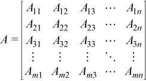
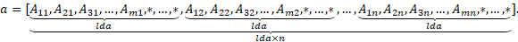
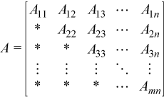
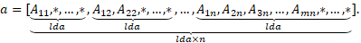
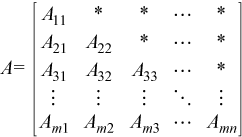
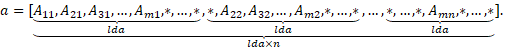
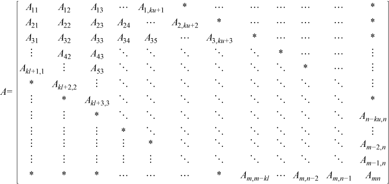
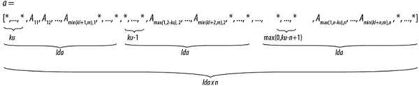
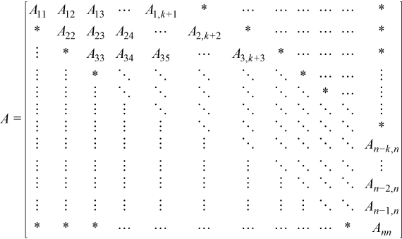
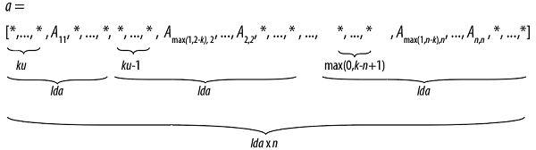
.. |image10| image:: equations/GUID-B9AEF80A-AD5F-4B59-9F21-60672FB15ee6.png
   :class: img-middle
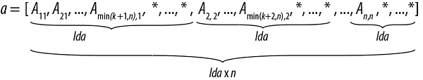
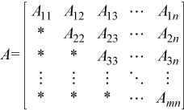
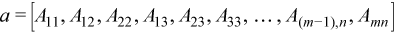
.. |image14| image:: equations/GUID-B9AEF80A-AD5F-4B59-9F21-60672FB15ee9.png
   :class: img-middle
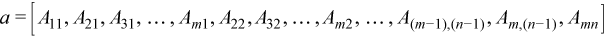
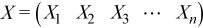
.. |image17| image:: equations/GUID-EA1939AE-5968-4E6A-8396-6F44E73939AF-low.png

